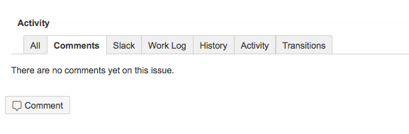
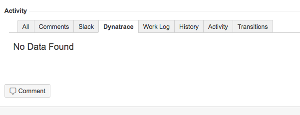
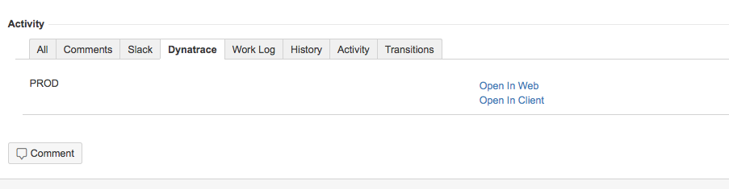
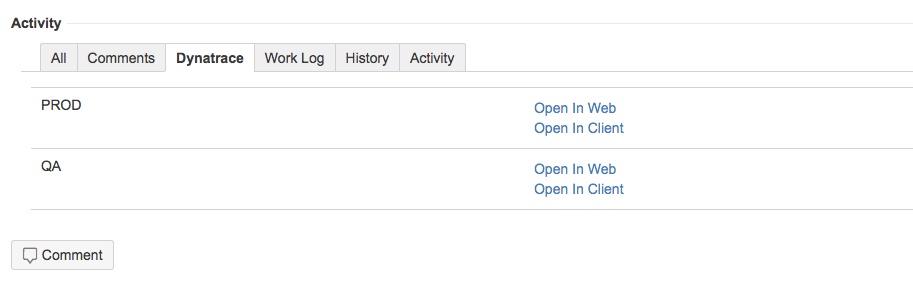

#**Dynatrace Plugin for Jira**

This plugin is installed in Atlassian Jira to link issues to stored sessions in Dynatrace Application Monitoring.  It has been tested with Jira 7.2.5 and AppMon 6.5

##Configuration

###AppMon Configuration
A user account will need to be created in AppMon to support Jira integration.  It is recommended to create a specific user, group, and role for "REST service accounts" with limited permissions to perform necessary tasks.
The current version of the plugin works against default ports of **443** for the HTTPS REST management port and **9911** for the web dashboards, necessary for some advanced usage coming in a later version.  Please open an issue if you need support for more ports

###Jira Configuration
A **jira-dynatrace-plugin.properties** file will be needed in order to use the plugin, or else it will default to unlikely values (localhost from the Jira box).  Please see **examples/jira-dynatrace-plugin.properties** for usage.  This file will need to be dropped into JIRA_HOME, wherever that may be for your installation.  See https://confluence.atlassian.com/jirakb/how-to-locate-jira-home-directory-313466063.html for more info (a little outdated but gives you the gist of how to get there)
 
##Installation
There is nothing to install on the Dynatrace AppMon server, just in Jira.  Install the .jar file using the normal method of Administration -> Plugins.  

##Usage
###Issue Tab Panel

**_Issue in project without Dynatrace Plugin Enabled:_**

**_Issue in project with Dynatrace Plugin Enabled (no data):_**

**_Issue in project with Dynatrace enabled and data on one server:_**

**_Issue in project with Dynatrace enabled and data on multiple servers:_**

###Link Session to Ticket

Sessions are linked automatically to tickets, provided the session name matches exactly the ticket key (e.g. APPSUPPORT-2595).  Note that this means that you should not check "append timestamp" when you store a session in Dynatrace.

You can right-click a transaction (PurePath, User Action, or Visit) or group of transactions and choose Sessions → Store Session, or else store an entire timeframe by right clicking on the system profile.  More info: 